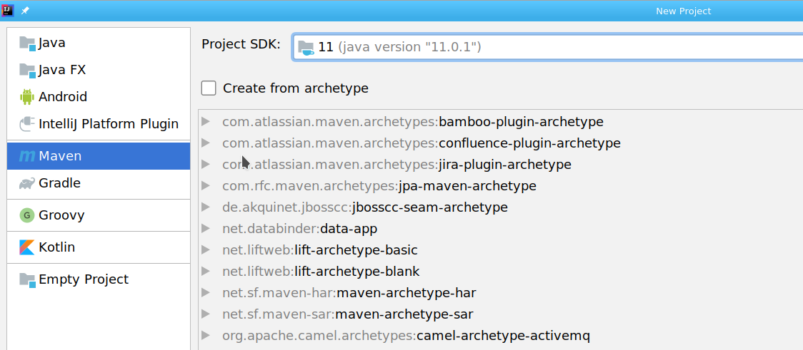
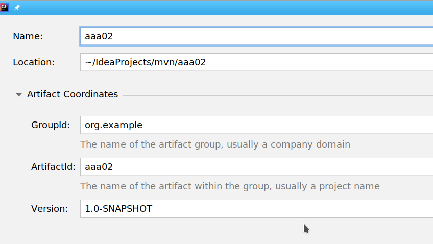
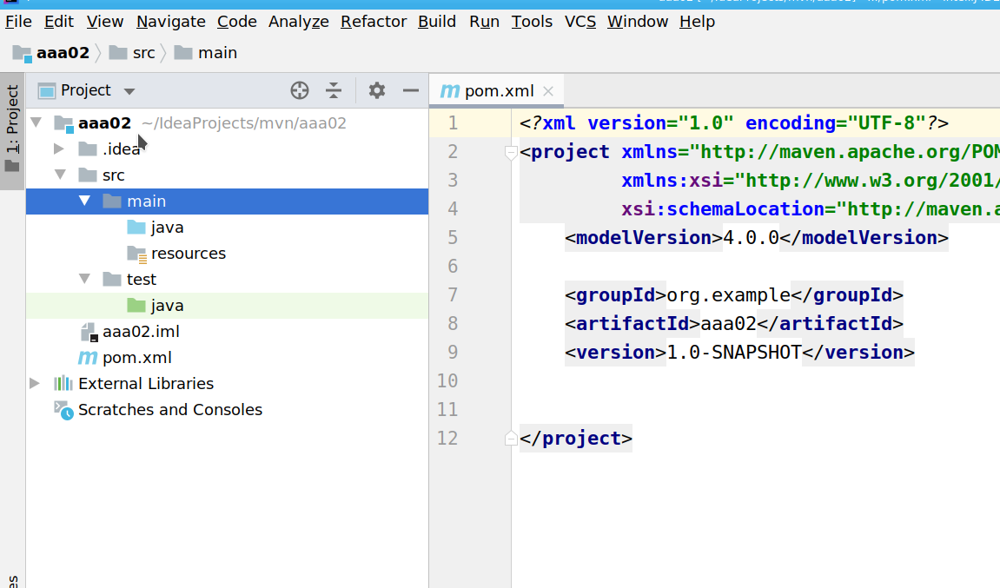

= Intellaj and Maven
Doc Writer <doc.writer@asciidoctor.org>
v1.0, 2014-01-01

:toc:
:imagesdir: assets/images
:homepage: https://asciidoctor.org
:numbered:

== Creating The Project
https://www.youtube.com/watch?v=pt3uB0sd5kY&t=76s

=== starting maven

File New Project
Then Chose Maven

=== Seting up maven

enable Maven Auto import

== The Main screen

Here you start of with the pom.xml file.
We have the project window open on the left.
And we have the pom.xml file open on the right.

IJ has created the default directory structure for maven

== open maven projects window

// ++++
// <iframe width="1078" height="480" src="https://www.youtube.com/embed/rPQoq7ThGAU" frameborder="0" allow="autoplay; encrypted-media" allowfullscreen></iframe>
// ++++

== straight too the vid
link:vid/03_lookAtMaven.mp4[]

// == the url

// link:a.html[]

== insert Dependinciew

link:vid/05_templates.mp4[]