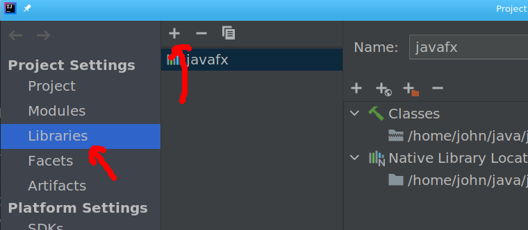
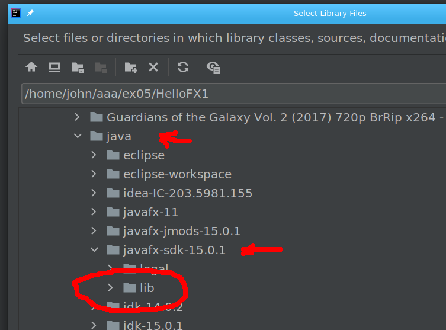

:sectnums:
== Add javaFX Libraries

=== open the Project Settings tab

This tabb allows you to alter different  parts of your project setting. You will use it to add libraries to your project

----
File --> Project Structure
----

You will see three columns in this tab

==== First column
The first column allows you to set
sections of the project settings.
You will want the libraries section

==== Second Columb
The second column allows you to
add or remove different libraries.
To add a javaFX library you will press the
pluss buttom " + " at the top of the page.

When this button is pressed
a dropdown is displayed.
From there you chose java
and  the Select Library Files is displayed

You simply use this to select the
location of the directory that
your libraries are stored in.
