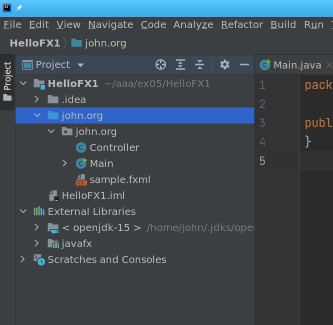

:sectnums:
== Create the JavaFX project
. Provide a name to the project,
like [red]#HelloFX#.

. rename the [red]#sample# package to [red]#org.openjfx#

=== Change the sample dir
In the project window
go to the sample directory
and change it to john.org

To do this Right click the source directory
that is in the and chose
----
Refactor --> Rename
----
Here is what

.Old Directory Structure
----
[john@localhost javaFX]$ tree /home/john/aaa/ex05/javaFX/
/home/john/aaa/ex05/javaFX/
├── javaFX.iml
└── src
    └── sample
        ├── Controller.java
        ├── Main.java
        └── sample.fxml

2 directories, 4 files
[john@localhost javaFX]$
----
You highlight the text that you want to change.
The shortcut for renaming is
Ctrl R R

The directory tree should look like this after
you have changed things

.New Directory Structure

----
[john@localhost javaFX]$ tree ~/aaa/ex05/javafx/
/home/john/aaa/ex05/javafx/
├── javafx.iml
└── src
    └── john
        └── org
            ├── Controller.java
            ├── Main.java
            └── sample.fxml

8 directories, 7 files
[john@localhost javaFX]$
----

=== Change the run debug info

When you change the file structure the ide will not
automaticly change the info in the run debug
options

you will notice that old source directory is
still in the compiler options. You will notice that
it is now in [red]#red# .
You will need to change this to john.org

