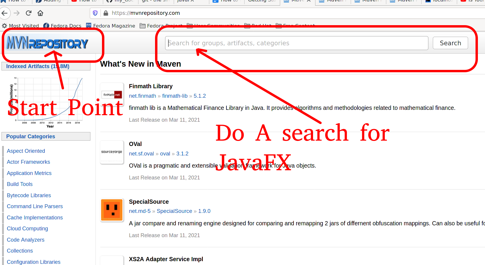
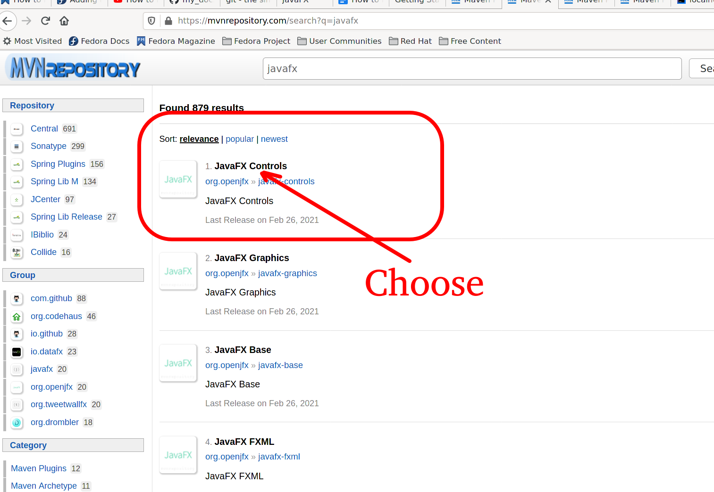
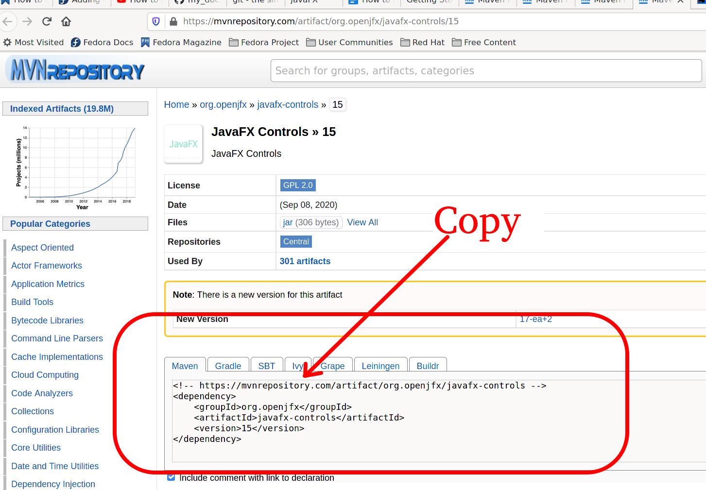
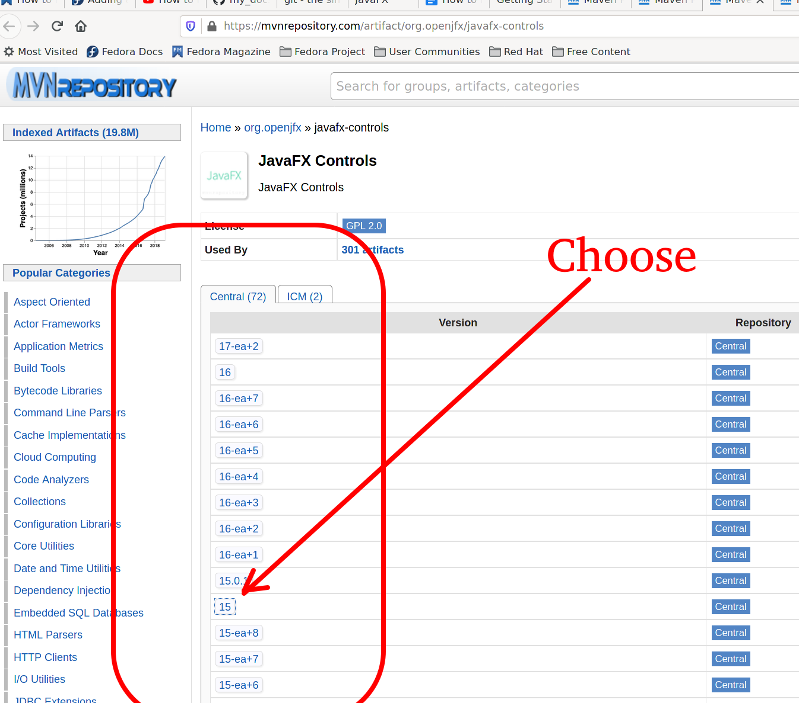

https://mvnrepository.com/

We are at the maven repository.
From there we need to do a search.
This is displayed as Point [big red]#*1).*#.

After we have searched for JavaFX
we have a list of

The first thing that we look at is the start point
If we click the MVNRepository link
we will be taken to the maven home Page 

=== N0 2
You will see the javaFX Controlls Repository.
This is what we are looking for.
Click this repository.
We will taken to the next page.
Where we can chose the version of the repository

Here we have currently done a search for javaFX.
The search has come up with all the repositories versions for javaFX.
